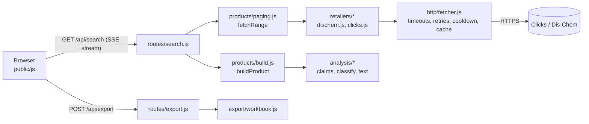

# Architecture

Read this first. It explains how the pieces fit so you can find the right file quickly.

## The big picture



There is **no database** and **no build step**. Every request fetches live pages from the retailers, parses
them, and streams the result to the browser. Nothing is stored on the server except small in-memory caches.

## Life of a search

1. The user types a term. `public/js/actions/search.js` opens an **EventSource** to `/api/search`.
2. `src/routes/search.js` validates the term, then runs **each store in parallel** (`Promise.all`).
   One store failing is caught and reported without affecting the others.
3. For each store, `products/paging.js` (`fetchRange`) asks the retailer adapter for pages until it has
   the requested window `[offset, offset + limit)`. It stitches across the store's own page boundaries and
   reports honest facts: `total`, `next`, `hasMore`, and a `note` if the store cuts us short.
4. For every listing item, `products/build.js` (`buildProduct`) fetches the **product page** (with limited
   concurrency and small pauses) and combines listing + detail + text analysis into one **Product**.
5. Each Product is sent as a `product` event the moment it is ready, so the UI fills in progressively.
6. The browser stores it in `state.items`, calls `schedule()`, and a render ~30 ms later patches the DOM.

### Server-Sent Events contract (`GET /api/search`)

| Event     | Payload                                                                      |
| --------- | ---------------------------------------------------------------------------- |
| `status`  | `{source, label, state, total, next, hasMore, note, warning, message, kind}` |
| `product` | a [Product](#the-product-record)                                             |
| `fatal`   | `{message}` for bad input (stream ends)                                      |
| `done`    | `{}` once every store has finished                                           |

`state` is one of `searching`, `found`, `done`, `error`.

## The Product record

Defined as JSDoc in `src/types.js`. Key idea: **every field except `id`, `name` and `url` may be `null`**,
which means "the retailer did not state it". Nothing downstream may replace `null` with a guess.
The UI shows `null` as "Not found" / "Not stated"; the Excel export writes "Not found".

## Server layout

| Module                 | Responsibility                                                                         |
| ---------------------- | -------------------------------------------------------------------------------------- |
| `config.js`            | Reads the environment once into a frozen object. All tunables live here                |
| `app.js`               | Assembles Express. **Order of `app.use` is the security model** (see below)            |
| `auth/`                | `session.js` signed cookies, `lockout.js` brute-force guard, `index.js` routes+gate    |
| `http/fetcher.js`      | The only outbound HTTP. Timeouts, retry of transient errors, block detection           |
| `retailers/<store>.js` | Pure `parseSearchPage` / `parseProductPage` + a small adapter with `page()`/`detail()` |
| `analysis/`            | Pure functions turning retailer text into claims, type, gender, ingredients            |
| `products/`            | `paging.js`, `build.js`, `pool.js` (concurrency with polite pauses)                    |
| `export/workbook.js`   | Builds the .xlsx; owns the column contract with the team's sheet                       |
| `routes/`              | Thin HTTP handlers; no business logic                                                  |

**Dependency direction:** `routes` → `products` → `retailers` → `http` ; `analysis` and `util` depend on nothing.
Anything that touches the network or the clock accepts it as a parameter so tests can fake it.

### Request order and the security model (`src/app.js`)

1. `/healthz` is open (the host's health check).
2. Static assets (`/css`, `/js`) are open. They are public code, not secrets (this repo is public).
3. `/login`, `/api/login`, `/api/logout` are open.
4. **`auth.gate`.** Everything below requires a signed-in session.
5. `GET /` serves `views/app.html`. It lives **outside** `public/` on purpose, so it cannot be fetched without the gate.
6. `/api/me`, `/api/search`, `/api/product`, `/api/export`.

Sessions are **stateless**: the cookie is `base64(payload).HMAC`. Consequences worth knowing:
signing out clears the browser's cookie but cannot revoke a stolen one before it expires (12 hours, or 30 days with
"keep me signed in"). **Changing `APP_PASSWORD` or `SESSION_SECRET` instantly invalidates every session.**

## Front-end layout (`public/js`)

Native ES modules. One-directional data flow:

```
events.js ──► actions/*  ──► state.js ──► schedule() ──► render.js ──► ui/*  ──► DOM
 (listeners)   (what the user    (single source   (batches    (one function     (each draws
               does; may call     of truth)         ~30ms)      makes screen      one part)
               api/*)                                           match state)
```

- **`state.js`**: the one mutable object. UI modules only read it; actions write it.
- **`render.js`**: `renderAll()` calls each `ui/*` renderer. Each is cheap and idempotent.
- **`ui/list.js`, `ui/gallery.js`**: rows/cards are **created once and reused** (a `Map` keyed by product id), then
  moved into order. That is why results stream in without flicker or lost scroll. A product's `_v` is bumped to
  force a rebuild of just that row.
- **`scheduler.js`**: a separate tiny module so UI files can call `schedule()` without importing `render.js`
  (which imports them): no circular imports.
- **`events.js`**: every listener, in one file. Lists use **event delegation** via `data-act="..."` attributes,
  so rows can be rebuilt without re-attaching handlers.
- **`api/`**: the only code that calls `fetch`/`EventSource`.
- **`lib/`**: framework-free helpers (`esc`, `money`, `prefs`, `toast`, `tween`, `dom`).

**XSS rule:** any string that originated from a retailer must pass through `esc()` before going into `innerHTML`.

## CSS layout (`public/css`)

`main.css` imports one file per component, in order: `tokens` (colours, fonts, radii, dark theme) → `base` →
components → `responsive` (always last so it can override). To restyle the brand, start with `tokens.css`.

## Design decisions (and why)

| Decision                             | Reason                                                                                  |
| ------------------------------------ | --------------------------------------------------------------------------------------- |
| Scrape public pages, no retailer API | Neither retailer offers a public API. Adapters isolate the fragile part                 |
| Server-Sent Events, not polling      | Results appear as they load; simple; works through proxies with `X-Accel-Buffering: no` |
| No database                          | Data is live by definition; nothing to migrate, back up, or secure                      |
| No front-end framework or build step | Fewer moving parts for a small team; the app is small enough to read in an hour         |
| Stateless signed-cookie sessions     | Survive restarts and free-tier sleeping with no store (trade-off noted above)           |
| `null` instead of defaults           | The product promise: never present a guess as a fact                                    |
| Cooldown after a block               | Hammering a store that already blocked us only makes it worse                           |
| Parsers are pure functions of HTML   | Testable offline; when a site changes, the fix is local and obvious                     |

## Known limits

- Retailer markup can change at any time. A `layout` error in the UI means a parser needs an update.
- Retailers may block cloud hosts more aggressively than home connections.
- The lockout counter and caches are in memory, so a restart clears them. That is acceptable for one user.
- Clicks prints no total; we derive it from the last results page (one extra request, cached for 3 minutes).
